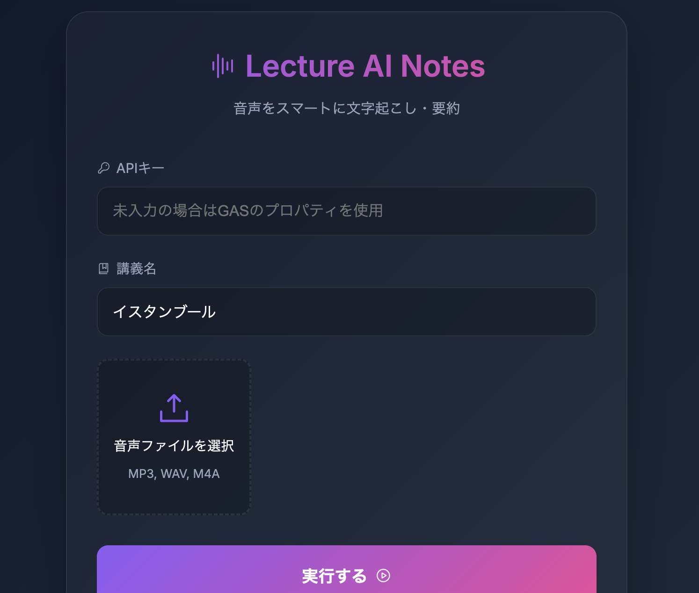
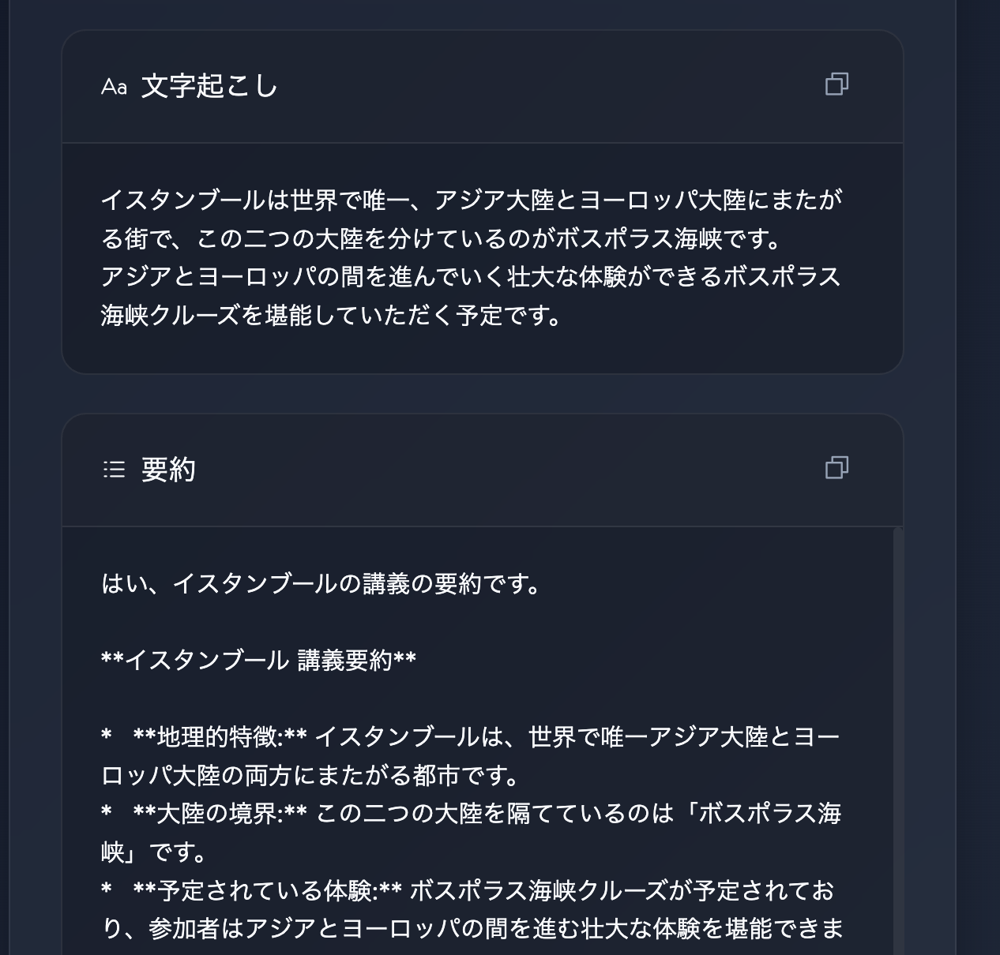

# Lecture Audio Notes

AIを活用した、講義音声の自動文字起こし＆要約ツールです。Google Apps Script (GAS) と Gemini API を組み合わせて動作します。

## 概要

講義の音声をアップロードするだけで、AIが瞬時に内容を書き起こし、3行の要約と重要ポイントに整理してノートを作成します。スタイリッシュなダークモード（グラスモーフィズム）のインターフェースを採用しており、学習効率を最大化します。

## プレビュー



## 主な機能
- **自動文字起こし**: 音声ファイルをテキストに変換。
- **AI要約**: Gemini 1.5 Flashによる高精度な要約。
- **重要ポイント抽出**: [Decision], [TODO], [Pending] タグによる構造化。
- **ワンクリックコピー**: 生成されたノートをクリップボードに即座にコピー。

## セットアップ方法

### 1. 準備物
- Google アカウント
- Gemini API キー（[Google AI Studio](https://aistudio.google.com/)で取得可能）

### 2. デプロイ手順 (claspを使用する場合)
本プロジェクトは `clasp` を使用してローカルで開発・管理されています。
```bash
# プロジェクトのクローン（またはダウンロード）
git clone <repository-url>
cd LectureAudioNotes

# 依存関係のインストール
npm install

# GASへログインとプッシュ
clasp login
clasp push
```

### 3. GASの設定（スクリプトプロパティ）
GASのエディタの「プロジェクトの設定」>「スクリプトプロパティ」に、以下の情報を追加してください。
- `GEMINI_API_KEY`: 取得したAPIキー

*※アプリ画面上の「APIキー」入力欄に直接入力して使用することも可能です（その場合、ブラウザのlocalStorageに保存されます）。*

## 技術スタック
- **Frontend**: HTML5, Vanilla CSS (Glassmorphism), JavaScript
- **Backend**: Google Apps Script
- **AI Engine**: Gemini 1.5 Flash
- **UI Assets**: Phosphor Icons, Google Fonts (Inter)

## ライセンス
MIT License
